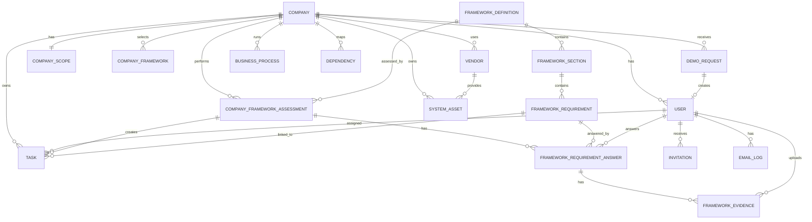

# 09 - Database ERD

## Purpose

This document explains the main database structure of Framework360.

It is based on the Prisma schema in:

```text
backend/prisma/schema.prisma
```

The database uses PostgreSQL through Prisma ORM.

In simple words:

```text
The database stores companies, users, demo requests, frameworks, assessments, requirements, answers, evidence, tasks, vendors, systems, business processes, and dependencies.
```

---

## High-level database map

```text
Company
  ├── Users
  ├── Demo Requests
  ├── Company Scope
  ├── Selected Frameworks
  ├── Framework Assessments
  │     ├── Requirement Answers
  │     │     └── Evidence Uploads
  │     └── Tasks
  ├── Vendors
  │     └── Systems
  ├── Systems
  ├── Business Processes
  └── Dependencies

Framework Definition
  └── Framework Sections
        └── Framework Requirements
              ├── Requirement Answers
              └── Tasks
```

---

## Main ERD diagram



---

## Core models

## Company

The `Company` model is the center of the system.

It represents a customer organization.

Important fields:

```text
id
name
cvr
sector
country
createdAt
updatedAt
```

A company can have:

```text
Many users
Many selected frameworks
Many framework assessments
Many tasks
One company scope
Many vendors
Many systems
Many business processes
Many dependencies
Many demo requests
```

Example:

```text
Company: CyberPartners
CVR: 12345678
Sector: IT
Country: DK
```

---

## CompanyScope

`CompanyScope` stores extra information about the company’s operations.

It helps decide which frameworks may apply.

Important fields:

```text
employeeCount
processesPersonalData
handlesSensitiveData
acceptsCardPayments
usesAiSystems
servesFinancialCustomers
isDigitalServiceProvider
operatesCriticalInfrastructure
hasEuCustomers
usesCloudProviders
hasCriticalSuppliers
completedAt
```

Example:

```text
Company processes personal data: true
Company uses cloud providers: true
Company is digital service provider: true
```

This information may help recommend frameworks such as GDPR, ISO 27001, NIS2, DORA, or AI Act.

Relationship:

```text
One Company has one CompanyScope
```

---

## User

The `User` model stores people who can log in.

Important fields:

```text
id
firstName
lastName
email
password
role
isActive
mustChangePassword
onboardingCompleted
lastLogin
companyId
```

A user may belong to a company.

User roles include:

```text
PLATFORM_ADMIN
CUSTOMER_ADMIN
COMPLIANCE_MANAGER
EVIDENCE_CONTRIBUTOR
AUDITOR
```

Example:

```text
User: Company administrator
Role: CUSTOMER_ADMIN
Company: CyberPartners
```

Relationships:

```text
One Company has many Users
One User can answer many requirements
One User can upload many evidence files
One User can be assigned many tasks
```

---

## DemoRequest

`DemoRequest` stores public demo requests submitted from `/requestdemo`.

Important fields:

```text
email
firstName
lastName
companyName
jobTitle
country
status
companyId
createdUserId
```

Statuses include:

```text
PENDING
EMAILED
ACTIVATED
EXPIRED
REJECTED
```

Demo request flow:

```text
Visitor submits request
  ↓
DemoRequest is created with PENDING status
  ↓
Platform admin activates request
  ↓
Company is created if needed
  ↓
User is created
  ↓
DemoRequest becomes ACTIVATED
```

Relationship:

```text
One DemoRequest may create one User
One DemoRequest may be connected to one Company
```

---

## Invitation

`Invitation` stores invitation or reset tokens.

Important fields:

```text
userId
type
secretHash
expiresAt
usedAt
createdAt
```

Invitation types include:

```text
DEMO_LOGIN
PASSWORD_RESET
```

This model helps support secure invitation or password reset flows.

---

## EmailLog

`EmailLog` records emails that the system sends or tries to send.

Important fields:

```text
userId
toEmail
type
subject
sentAt
failedAt
errorMessage
createdAt
```

Email types include:

```text
DEMO_ACCESS
PASSWORD_RESET
WELCOME
```

Example:

```text
Email type: DEMO_ACCESS
Subject: Your demo is ready
To: new user email
```

---

## Framework models

## FrameworkDefinition

`FrameworkDefinition` represents a compliance framework.

Examples:

```text
GDPR
NIS2
DORA
AI_ACT
ISO27001
ISO27002
SOC2
NIST_CSF
PCI_DSS
```

Important fields:

```text
code
name
description
category
isActive
```

Relationship:

```text
One FrameworkDefinition has many FrameworkSections
One FrameworkDefinition can have many company assessments
```

---

## FrameworkSection

`FrameworkSection` groups requirements inside a framework.

Example:

```text
Framework: ISO 27001
Section: Access Control
Section: Asset Management
Section: Incident Management
```

Important fields:

```text
frameworkDefinitionId
title
description
order
weight
```

Relationship:

```text
One FrameworkDefinition has many FrameworkSections
One FrameworkSection has many FrameworkRequirements
```

---

## FrameworkRequirement

`FrameworkRequirement` stores individual questions or controls.

Important fields:

```text
sectionId
question
description
reference
implementationGuide
exampleEvidence
riskIfMissing
order
weight
isRequired
isActive
```

Example:

```text
Question: Does the company maintain an asset inventory?
Example evidence: Asset inventory document
Risk if missing: Unknown systems and weak control over information assets
```

Relationship:

```text
One FrameworkRequirement belongs to one FrameworkSection
One FrameworkRequirement can have many answers
One FrameworkRequirement can have many tasks
```

---

## CompanyFramework

`CompanyFramework` stores which frameworks a company has selected.

Important fields:

```text
companyId
framework
createdAt
```

Example:

```text
Company: CyberPartners
Selected framework: ISO27001
```

Relationship:

```text
One Company has many selected frameworks
```

---

## Assessment models

## CompanyFrameworkAssessment

`CompanyFrameworkAssessment` stores a company’s assessment for one framework.

Important fields:

```text
companyId
frameworkDefinitionId
status
score
completedAt
```

Assessment statuses include:

```text
IN_PROGRESS
COMPLETED
```

Example:

```text
Company: CyberPartners
Framework: ISO27001
Status: IN_PROGRESS
Score: 62.5
```

Relationship:

```text
One Company has many assessments
One FrameworkDefinition can be assessed by many companies
One Assessment has many Requirement Answers
One Assessment can have many Tasks
```

---

## FrameworkRequirementAnswer

`FrameworkRequirementAnswer` stores how a company answered one requirement during an assessment.

Important fields:

```text
assessmentId
requirementId
status
note
answeredByUserId
answeredAt
```

Answer statuses include:

```text
YES
PARTIAL
NO
NOT_APPLICABLE
UNANSWERED
```

Example:

```text
Requirement: Asset inventory
Answer status: NO
Note: No updated asset inventory currently exists
Answered by: Customer admin
```

This model is where gaps are identified.

Example gap:

```text
Answer status: NO
Meaning: Requirement is missing
```

Relationship:

```text
One Assessment has many Requirement Answers
One Requirement can have many Answers from different company assessments
One Requirement Answer can have many Evidence uploads
```

---

## Evidence and task models

## FrameworkEvidence

`FrameworkEvidence` stores uploaded evidence linked to a requirement answer.

Important fields:

```text
answerId
filename
filePath
fileType
size
uploadedByUserId
description
createdAt
```

Example:

```text
Evidence: Asset_Inventory.xlsx
Linked answer: ISO 27001 asset inventory answer
Uploaded by: IT Manager
```

Relationship:

```text
One Requirement Answer has many Evidence files
One User can upload many Evidence files
```

---

## Task

`Task` stores actions that need to be completed.

Important fields:

```text
companyId
assessmentId
requirementId
title
description
status
priority
assignedToUserId
dueDate
```

Task statuses include:

```text
OPEN
IN_PROGRESS
DONE
```

Task priorities include:

```text
LOW
MEDIUM
HIGH
```

Example:

```text
Title: Create updated asset inventory
Status: OPEN
Priority: HIGH
Assigned to: IT Manager
Requirement: ISO 27001 asset inventory
```

Relationship:

```text
One Company has many Tasks
One Task may belong to one Assessment
One Task may be linked to one Requirement
One Task may be assigned to one User
```

---

## AuditLog

`AuditLog` stores important system actions.

Important fields:

```text
userId
action
entity
entityId
metadata
createdAt
```

Example actions:

```text
LOGIN_SUCCESS
DEMO_ACTIVATED
EVIDENCE_UPLOADED
TASK_UPDATED
```

This helps track who did what in the system.

---

## Vendor, system, process, and dependency models

## Vendor

`Vendor` stores third-party providers.

Important fields:

```text
companyId
name
description
website
contactEmail
criticality
isCriticalSupplier
hasDpa
hasSla
hasSecurityReview
country
reviewDate
```

Criticality values:

```text
LOW
MEDIUM
HIGH
CRITICAL
```

Example:

```text
Vendor: Microsoft
Criticality: HIGH
Has DPA: true
Has security review: true
```

Relationship:

```text
One Company has many Vendors
One Vendor can provide many Systems
```

---

## SystemAsset

`SystemAsset` stores systems, applications, services, or technical assets.

Important fields:

```text
companyId
name
description
type
criticality
ownerDepartment
ownerUserId
vendorId
containsPersonalData
containsSensitiveData
internetExposed
mfaEnabled
backupEnabled
loggingEnabled
monitoringEnabled
rtoMinutes
rpoMinutes
status
```

System types include:

```text
APPLICATION
DATABASE
INFRASTRUCTURE
CLOUD_SERVICE
SAAS
API
WEBSITE
IDENTITY_PROVIDER
SECURITY_TOOL
BACKUP_SYSTEM
EMAIL_SYSTEM
ERP
CRM
HR_SYSTEM
PAYMENT_SYSTEM
OTHER
```

System statuses include:

```text
ACTIVE
INACTIVE
PLANNED
RETIRED
```

Example:

```text
System: Microsoft 365
Type: SAAS
Criticality: HIGH
Contains personal data: true
Vendor: Microsoft
MFA enabled: true
Backup enabled: true
```

Relationship:

```text
One Company has many System Assets
One System may have one Vendor
One System may have one Owner User
```

---

## BusinessProcess

`BusinessProcess` stores important company processes.

Important fields:

```text
companyId
name
description
ownerDepartment
criticality
maxTolerableDowntimeMinutes
manualWorkaroundAvailable
```

Example:

```text
Process: Customer support
Owner department: Support
Criticality: HIGH
Manual workaround available: false
```

Relationship:

```text
One Company has many Business Processes
```

---

## Dependency

`Dependency` stores relationships between systems, vendors, and business processes.

Important fields:

```text
companyId
sourceType
sourceId
targetType
targetId
dependencyType
isCritical
failureImpact
manualWorkaroundAvailable
notes
```

Dependency node types:

```text
SYSTEM
VENDOR
BUSINESS_PROCESS
```

Dependency types:

```text
AUTHENTICATION
HOSTING
DATA
EMAIL
BACKUP
PAYMENT
NETWORK
MANUAL_PROCESS
OTHER
```

Example:

```text
Source: Business process Customer Support
Target: System CRM
Dependency type: DATA
Critical: true
Failure impact: Customer support cannot operate normally
```

Relationship:

```text
One Company has many Dependencies
A Dependency connects one source node to one target node
Source and target may be systems, vendors, or business processes
```

---

## Important enums

The schema defines several enums that control allowed values.

### Sector

Examples:

```text
FINANCE
HEALTHCARE
IT
TELECOM
PUBLIC
MANUFACTURING
RETAIL
EDUCATION
OTHER
```

Used by:

```text
Company
```

---

### Framework

Examples:

```text
GDPR
NIS2
DORA
AI_ACT
ISO27001
SOC2
NIST_CSF
PCI_DSS
```

Used by:

```text
CompanyFramework
FrameworkDefinition
```

---

### UserRole

```text
PLATFORM_ADMIN
CUSTOMER_ADMIN
COMPLIANCE_MANAGER
EVIDENCE_CONTRIBUTOR
AUDITOR
```

Used by:

```text
User
```

---

### RequirementAnswerStatus

```text
YES
PARTIAL
NO
NOT_APPLICABLE
UNANSWERED
```

Used by:

```text
FrameworkRequirementAnswer
```

---

### TaskStatus

```text
OPEN
IN_PROGRESS
DONE
```

Used by:

```text
Task
```

---

### Criticality

```text
LOW
MEDIUM
HIGH
CRITICAL
```

Used by:

```text
Vendor
SystemAsset
BusinessProcess
```

---

## End-to-end database example

Imagine CyberPartners performs an ISO 27001 assessment.

### 1. Company exists

```text
Company: CyberPartners
Sector: IT
Country: DK
```

### 2. User belongs to company

```text
User: Simon
Role: CUSTOMER_ADMIN
Company: CyberPartners
```

### 3. Company selects framework

```text
CompanyFramework: ISO27001
```

### 4. Framework definition exists

```text
FrameworkDefinition: ISO27001
```

### 5. Framework has sections and requirements

```text
Section: Asset Management
Requirement: Maintain an asset inventory
```

### 6. Company creates assessment

```text
CompanyFrameworkAssessment:
Company: CyberPartners
Framework: ISO27001
Status: IN_PROGRESS
```

### 7. Requirement is answered

```text
FrameworkRequirementAnswer:
Requirement: Maintain asset inventory
Status: NO
Note: No updated inventory exists
```

### 8. Task is created

```text
Task:
Title: Create updated asset inventory
Priority: HIGH
Status: OPEN
```

### 9. Evidence is uploaded

```text
FrameworkEvidence:
Filename: Asset_Inventory.xlsx
Linked to: Requirement answer
```

### 10. Systems and vendors are registered

```text
Vendor: Microsoft
System: Microsoft 365
Business Process: Employee onboarding
Dependency: Employee onboarding depends on Microsoft 365
```

The database now connects:

```text
Company -> Framework -> Requirement -> Answer -> Task -> Evidence
Company -> Vendor -> System -> Business Process -> Dependency
```

---

## Simple summary

The database supports the whole compliance workflow:

```text
Company stores the customer organization.
User stores people who log in.
DemoRequest stores access requests.
FrameworkDefinition stores available frameworks.
FrameworkSection groups requirements.
FrameworkRequirement stores compliance questions.
CompanyFrameworkAssessment stores company assessment progress.
FrameworkRequirementAnswer stores answers and gaps.
FrameworkEvidence stores uploaded proof.
Task stores actions to fix gaps.
Vendor stores third-party providers.
SystemAsset stores company systems.
BusinessProcess stores company activities.
Dependency stores relationships between systems, vendors, and processes.
AuditLog stores important actions.
```

Complete relationship:

```text
Company -> Users
Company -> Frameworks -> Assessments -> Requirement Answers -> Evidence
Company -> Tasks
Company -> Vendors -> Systems
Company -> Business Processes
Company -> Dependencies
```
